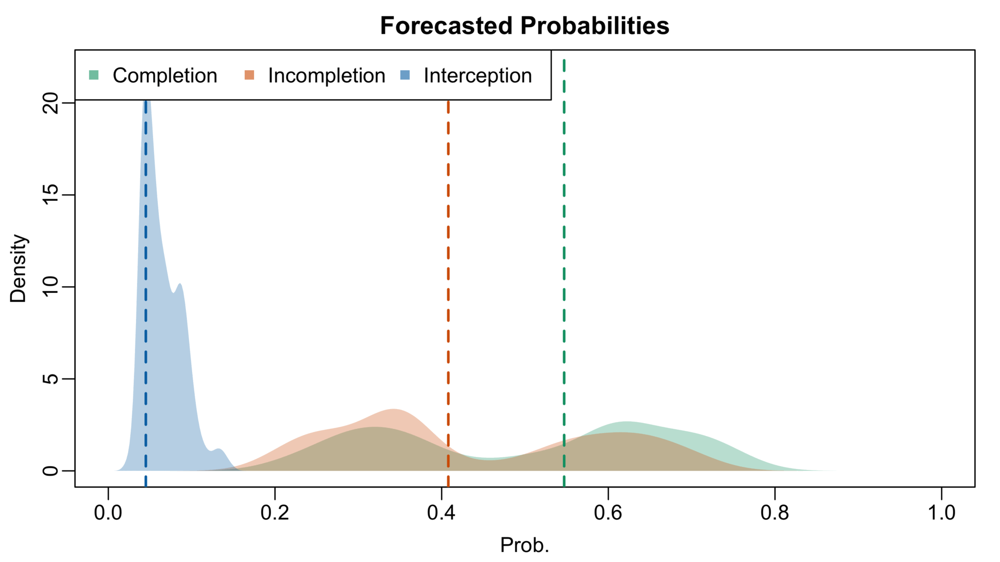

# Bayesian Dynamic Completion Probabilities

## Overview

One of the earliest uses of Next Generation Stats tracking data was estimating the probability that a receiver successfully catches a pass.
Completion probabilities models are useful for player evaluation, allowing analysts and teams to quantify precisely how much credit or blame a receiver should get based for the outcome of an individual pass. Intuitively, a receiver who catches a ball with very low completion probability should receive much more credit than a receiver who catches a routine pass with high completion probability.
Similarly, a receiver who fails to catch a pass with high completion probability should receive much more blame than one who fails to catch a pass with very low completion probability.
Such intuition is encoded in the now-familiar catch probability over expected (CPOE) metric used to evaluate quarterbacks.

Completion probability models can also make replay videos more informative, engaging, and entertaining. One can, for instance, identify the completed pass with lowest completion probability within a game, week, or season; in some sense, this is would be most improbable catch within that fixed time window. One can then overlay the final completion probability on top of a video replay to communicate how improbable a particular reception was. Going further, one can cut the video to display multiple camera angles and overlay the values of several important model inputs (e.g., air yards, quarterback speed, receiver-defender separation) onto the screen. Such displays provide insight into what, precisely, made the catch so difficult.

In fact, the NFL produced and released several such videos in the 2018 season, with some even being run during commercial breaks during game.
For instance, [here is video package](https://www.nfl.com/videos/next-gen-stats-three-improbable-catches-week-1-258398) of three most improbable completions from Week 1 of the 2018 season.
While these videos are unquestionably informative, engaging, and entertaining, they are fundamentally static: with one exception (viz., quarterback speed), the figures overlaid on the screen are fixed at their final values.
Such static elements in an otherwise dynamic display can create the perception that what happens when the ball is in the air does not affect the final completion probability.
In this project, we develop a framework for producing dynamic completion probability forecasts that allows viewers to track how the probabilities of a completion, incompletion, and interception, evolve as the receiver and defender move when the ball is in the air.

Our model combines a model trained to predict pass outcomes (i.e., the `pass_result` variable supplied by the Big Data Bowl) using features measured at the time of pass (e.g., quarterback speed) and at the time that the ball arrives in the receiver's vicinity with a simple Bayesian of receiver and defender trajectories.
As documented by [Deshpande and Evans (2019)]()https://arxiv.org/abs/1910.12337 using data from the 2019 Big Data Bowl competition, the most important drivers of completion probability are the time-of-arrival variables, which can be computed using the player locations in the final frame of each play. 
The key challenge in developing frame-by-frame forecasts of these probabilities is that at any intermediate frame, the exact locations of the player at the time of the arrival is uncertain.
We overcome this challenge by fitting a Bayesian model after every frame that forecasts the remaining trajectories of the targeted receiver and defender.
The output of these frame-level models is a full posterior distribution of the players' remaining paths, which induces a posterior distribution of the "time-of-arrival" inputs needed
Thus, in each frame of a play, we (i) simulate the remaining trajectories from that posterior; (ii) compute the corresponding time of arrival inputs based on the simulated trajectory; (iii) pass those simulated inputs to our outcome model to get the estimated completion, incompletion, and interception probabilities; and finally (iv) use these probabilities to sample the actual outcome for the simulated route. 
Averaging over 1000 simulated trajectories, we obtain an estimate for the different outcome probabilities based only on the observed trajectories.

## Example Output

Using our framework, we can create animations showing how the uncertainty about player movement and pass outcome probabilities evolves over the course of a play.
Here are three examples from the 2023 NFL regular season.

**CeeDee Lamb Reception on 4th-and-1**

<figure>
  
  
</figure>

<!--

## Outcome Probability Model

We trained a simple random forest model to predict the pass result (i.e., completion, incompletion, or interception).
Based on the variables listed [NGS explainer video](https://youtu.be/U3G6xHyEyFY?t=32), we computed and extracted the following variables

We stress that one can replace our simple model with a more sophisticated one (e.g., NGS's completion probability model or one that predicts even more outcomes like pass breakups, defensive pass interference). The fundamental idea is that in each frame of the play, we will need to simulate the model inputs that are computed in the final frame.

## A Bayesian Bézier Curve Model

### Notation
Before describing our Bayesian model of receiver and defender trajectories, we must introduce some notation.
For simplicity, we only model the trajectories of the targetted receiver and the defender who is closest to the receiver at the time of arrival. 
Suppose that there are $T$ frames from the time that the ball is snapped ($t = 1$) to the time that the ball arrives in the receivers' vicinity ($t = T$; the final frame of each play in the Big Data Bowl data).
For each $t \in \{1, 2, \ldots, T\},$ let $r_{t} = (r_{x,t}, r_{y,t})$ be receivers' position in frame $t$ and for each $t < t' \in \{1, 2, \ldots, T\}$ let $r_{t:t'} = \{ r_{t}, \ldots, r_{t'} \}$ be the receiver's trajectory between frames $t$ and $t'.$
We denote the trajectories of the receiver's $x$ and $y$ position between times $t$ and $t'$ with $r_{x,t:t'}$ and $r_{y, t:t'}.$
We similarly denote the defender's position in frame $t$ and trajectory between $t$ and $t'$ with $d_{t} = (d_{x,t}, d_{y,t})$ and $d_{t:t'}.$ 

### Receiver Model

Following [Miller & Bornn (2017)](https://www.lukebornn.com/papers/miller_ssac_2017.pdf) and [Chu et al. (2019)](https://arxiv.org/pdf/1908.02423), we model the receiver's trajectory with a degree-$D$ Bézier curve. 
That is, if for $u \in [0,1],$ we let $\phi_{d}(u) = \binom{D}{d}u^{d}(1-u)^{D-d}$ be the $d$-th Bernstein polynomial, then we model independently for each $t = 1, \ldots, T$

$$
\begin{align}
r_{x,t} &= \mu^{r}_{x,t} + \sum_{d=0}^{D}{\beta^{r}_{x,d}\phi_{d}(t/T)} + \epsilon^{r}_{x,t} \\
r_{y,t} &= \mu^{r}_{y,t} + \sum_{d=0}^{D}{\beta^{r}_{y,d}\phi_{d}(t/T)} + \epsilon^{r}_{y,t},
\end{align}
$$

where the errors $\epsilon_{x,t}, \epsilon_{y,t}$ are independent $N(0,\sigma^{2});$ $\mu^r_{t} = (\mu^r_{x,t}, \mu^r_{y,t})$ is a soon-to-be-specified prior mean of the receiver's position at time $t.$ (see below); and the parameters $\beta^r_{x} = \{\beta^r_{x,0}, \ldots, \beta^r_{x,D}\}$ and $\beta^r_{y} = \{\beta^r_{y,0}, \ldots, \beta^r_{y,D}\}$ are to be estimated. The pairs $(\beta^r_{x,d}, \beta^r_{y,d})$ are the [*control points*](https://en.wikipedia.org/wiki/Control_point_(mathematics)) of the Bézier curve for the receiver's trajectory.

We take a Bayesian approach and specify independent $N(0,\tau^{2})$ for the $\beta^r_{x,t}$'s and $\beta^r_{y,t}$'s.
Under our specified joint probability model for the full receiver trajectory $r_{1:T}$ and the unknown parameters $\beta^r_{x}$ and $\beta^r_{y},$ the trajectories of the receiver's $x$ and $y$ are *marginally* independent with

$$
\begin{align}
r_{x,1:T} &\sim  \mathcal{N}_{T}\left( \mu^r_{x,1:T}, \Sigma^r\right) \\
r_{y,1:T} &\sim  \mathcal{N}_{T}\left( \mu^r_{y,1:T}, \Sigma^r\right),
\end{align}
$$

where $\Phi$ is a $T \times (D+1)$ matrix whose $(t,d)$ entry is $\phi_{d}(t/T)$ and $\Sigma^r = \tau^{2}\Phi\Phi^{\top} + \sigma^{2}I.$

#### Posterior Computation

At frame $t$, we wish to simulate the receiver's remaining trajectory $r_{(t+1):T}$ based on the observed trajectory up until time $t$, $r_{1:t}$ by drawing from the posterior distribution of $r_{(t+1):T} \vert r_{1:t}.$ 
It turns out that we can compute and simulate from this posterior distribution exactly *without having to resort to a (sometimes) computationally intensive approximations like Markov chain Monte Carlo.*
Specifically, if we partition $\Sigma^{r}$ into four blocks, separating the first $t$ rows/columns from the second $(T-t)$ rows/columns as

$$
\Sigma^{r} = 
\begin{pmatrix}
\Sigma_{1:t, 1:t} & \Sigma_{1:t,(t+1):T} \\
\Sigma_{(t+1):T,1:t} & \Sigma_{(t+1):T, (t+1):T},
\end{pmatrix}
$$

then, using standard results about the conditional distributions of multivariate normal distributions, we obtain the posterior distributions

$$
\begin{align}
r_{x,(t+1):T} \vert r_{x,1:t} &\sim  N_{T}\left( \mu^{r}_{x,(t+1):T} + \Sigma_{(t+1):T, 1:t} \Sigma_{1:t, 1:t}^{-1}\left( r_{x,1:t} - \mu^{r}_{x,1:t}\right), \Sigma_{(t+1):T, (t+1):T} - \Sigma_{(t+1):T, 1:t}\Sigma^{-1}_{1:t,1:t}\Sigma_{1:t, (t+1):T}\right) \\
r_{y,(t+1):T} \vert r_{y,1:t} &\sim  N_{T}\left( \mu^{r}_{y,(t+1):T} + \Sigma_{(t+1):T, 1:t} \Sigma_{1:t, 1:t}^{-1}\left( r_{y,1:t} - \mu^{r}_{y,1:t}\right), \Sigma_{(t+1):T, (t+1):T} - \Sigma_{(t+1):T, 1:t}\Sigma^{-1}_{1:t,1:t}\Sigma_{1:t, (t+1):T}\right)
\end{align}
$$

In practice, we compute the posterior distribution after re-centering the player's trajectories to start at the origin.
Then, when visualizing the trajectories and computing the outcome probabilities, we translate the simulated trajectories back to the original coordinate system. 

#### Specifying the Prior Mean

A key element in our model is the prior mean $\mu^r_t$ which represents the point on the field where we might reasonably expect the receiver will be in frame $t$ before the play begins.
If we had access to the offense's playbook, we could very easily compute the prior mean for each play; after all, $\mu^r_t$ is where the receiver is meant to be at time $t$ based on the route concept and play design.
Lacking such information and only knowing (i) the receiver's starting locaiton and (ii) where the ball lands, we set $\mu^r_{1:T}$ to be the set of equally spaced points lying on a straight-line path between the receiver's initial position and the ball's landing location.
In doing so, we view $\mu_{1:T}$ as a regularization target rather than a perfectly accurate representation of our prior knowledge.
The posterior "pulls" or "shrinks" the simulated trajectory $r_{(t+1):T}$ towards the prior mean trajectory $\mu^{r}_{(t+1):T}.$
The influence of the prior mean on simulated trajectories is greater earlier in a play (i.e., when $t$ is small and we have not observed much data) than later in the play (i.e., when $t$ is large and we have seen most of the route develop).
In practice, we have found that this arguably over-simplified prior specification works well. 

To illustrate this point, we simulated CeeDee Lamb's trajectores from the moment the ball was thrown in the play shown earlier using two different prior specificiations.
The red trajectores were generated when we specified the constant prior $\mu^r_{t} = r_{1}$ for each $t = 1, \ldots, T.$
According to this prior, the receiver remains fixed at his initial position for the duration of the play.
We see that the red posterior trajectories after 28 frames have Lamb circling back towards his initial position.

<figure>

</figure>

The green trajectories were generated using our simple prior specification.
Based on Lamb's position in the 2.8 seconds before the pass was thrown (i.e., the filled circles in the plot), we see that each simulated trajectory proceeds towards the ball's landing location (red cross). *A posteriori* these trajectories are shrunk slightly to the prior mean trajectory shown in the dashed red line.
Although this prior mean trajectory is over-simplified, it is reassuring to observe that Lamb's actual path (hollow circles) lines up closely with the green curves. 

#### Modeling the Nearest Defender

For simplicitly, we specify an entirely analogous model for the defender trajectory.
For the prior mean trajectory, we also draw a straight line between the defender's initial position and the ball's landing location.
While this assumption and the implied independent between receiver and defender trajectories is not wholly realistic, we note that it returns facially plausible results.

### Simulating Outcomes

In each frame, we draw 1000 simulate trajectories for the targetted receiver and defender and randomly draw the outcome (i.e., completion, incompletion, or interception) for the play based on each simulated trajectory.
To do this, we first compute the distance between the receiver and the nearest defender, sideline, and goallines at the end of each simulated trajectory.
Then, we pass these simulated time-of-arrival features to our fitted random forest model along with the fixed features like pass length, play duration, and quarterback speed, to obtain samples from the posterior distribution of outcome probabilities.
We finally randomly draw the play outcome for each simulated trajectory using the posterior samples of the outcome probabilities.

The density plots below show the posterior densities of the completion, incompletion, and interception probabilities one-half second (i.e., 5 frames) before the end of each of the three plays.
We see, for instance, that a half-second before Lamb catches the ball, there is 
<!--

--> 

### Other Implementation Details

In this work, we set $D = 10, \sigma = 1/36,$ and $\tau = 1.$

Importantly for broadcasters, our model admits very fast, exact posterior calculations (i.e., no Markov chain Monte Carlo is needed) and the simulated trajecotries and completion probabilities can be computed in a fraction of a second for each frame. 
Later, we outline potential extensions that relax these assumptions, albeit at higher computational cost. 
The modularity of our framework allows one to substitute any other Bayesian model of player trajectories and still produce engaging and informative visualizations. 

-->
