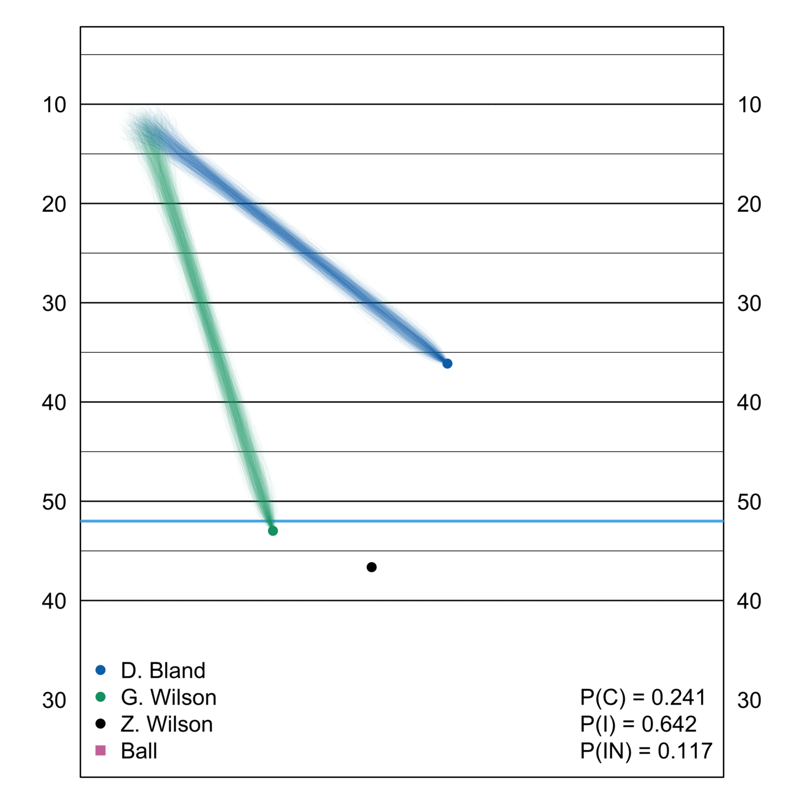

# Bayesian Dynamic Completion Probabilities

## Overview

One of the earliest uses of Next Generation Stats tracking data was estimating the probability that a receiver successfully catches a pass.
Completion probabilities models are useful for player evaluation, allowing analysts and teams to quantify precisely how much credit or blame a receiver should get based for the outcome of an individual pass. Intuitively, a receiver who catches a ball with very low completion probability should receive much more credit than a receiver who catches a routine pass with high completion probability.
Similarly, a receiver who fails to catch a pass with high completion probability should receive much more blame than one who fails to catch a pass with very low completion probability.
Such intuition is encoded in the now-familiar catch probability over expected (CPOE) metric used to evaluate quarterbacks.

Completion probability models can also make replay videos more informative, engaging, and entertaining. One can, for instance, identify the completed pass with lowest completion probability within a game, week, or season; in some sense, this is would be most improbable catch within that fixed time window. One can then overlay the final completion probability on top of a video replay to communicate how improbable a particular reception was. Going further, one can cut the video to display multiple camera angles and overlay the values of several important model inputs (e.g., air yards, quarterback speed, receiver-defender separation) onto the screen. Such displays provide insight into what, precisely, made the catch so difficult.

In fact, the NFL produced and released several such videos in the 2018 season, with some even being run during commercial breaks during game.
For instance, [here is video package](https://www.nfl.com/videos/next-gen-stats-three-improbable-catches-week-1-258398) of three most improbable completions from Week 1 of the 2018 season.
While these videos are unquestionably informative, engaging, and entertaining, they are fundamentally static: with one exception (viz., quarterback speed), the figures overlaid on the screen are fixed at their final values.
Such static elements in an otherwise dynamic display can create the perception that what happens when the ball is in the air does not affect the final completion probability.
In this project, we develop a framework for producing dynamic completion probability forecasts that allows viewers to track how the probabilities of a completion, incompletion, and interception, evolve as the receiver and defender move when the ball is in the air.

Our model combines a model trained to predict pass outcomes (i.e., the `pass_result` variable supplied by the Big Data Bowl) using features measured at the time of pass (e.g., quarterback speed) and at the time that the ball arrives in the receiver's vicinity with a simple Bayesian of receiver and defender trajectories.
As documented by [Deshpande and Evans (2019)]()https://arxiv.org/abs/1910.12337 using data from the 2019 Big Data Bowl competition, the most important drivers of completion probability are the time-of-arrival variables, which can be computed using the player locations in the final frame of each play. 
The key challenge in developing frame-by-frame forecasts of these probabilities is that at any intermediate frame, the exact locations of the player at the time of the arrival is uncertain.
We overcome this challenge by fitting a Bayesian model after every frame that forecasts the remaining trajectories of the targeted receiver and defender.
The output of these frame-level models is a full posterior distribution of the players' remaining paths, which induces a posterior distribution of the "time-of-arrival" inputs needed
Thus, in each frame of a play, we (i) simulate the remaining trajectories from that posterior; (ii) compute the corresponding time of arrival inputs based on the simulated trajectory; (iii) pass those simulated inputs to our outcome model to get the estimated completion, incompletion, and interception probabilities; and finally (iv) use these probabilities to sample the actual outcome for the simulated route. 
Averaging over 1000 simulated trajectories, we obtain an estimate for the different outcome probabilities based only on the observed trajectories.

## Example Output

Using our framework, we can create animations showing how the uncertainty about player movement and pass outcome probabilities evolves over the course of a play.
Here are three examples from the 2023 NFL regular season.

**CeeDee Lamb Reception**

<figure>
   
  
</figure>

**Malik Hooker Interception**

<figure>
  
  
</figure>

**DaRon Bland Interception**

<figure>
  
  
</figure>

## Code Organization

The code to generate the figures above and those in the corresponding submission for the Big Data Bowl are contained in the `scripts` directory.
If you wish to reproduce the analysis, you must first download the CSV files from the competition into the subdirectory `data/training`.
Then run the script `scripts/prepare_data.R`, which extracts the tracking data for the targeted receiver and defender for each play and saves it in the file `data/raw_data.RData`.

The script `scripts/fit_rf_model.R` fits the random forests for pass outcomes and saves the fitted model in the file `data/rf_model.RData`.
To produce the animations for the Bland and Hooker interceptions, you can then run `scripts/bland_animations.R` and `scripts/hooker_animations.R`. 
To generate the animations for the Lamb reception, you need to first run `scripts/prepare_ceedee_path.R` before running `scripts/ceedee_animations.R`.

The `scripts` directory also includes scripts for generating single-frame images from the Big Data Bowl submissions.
